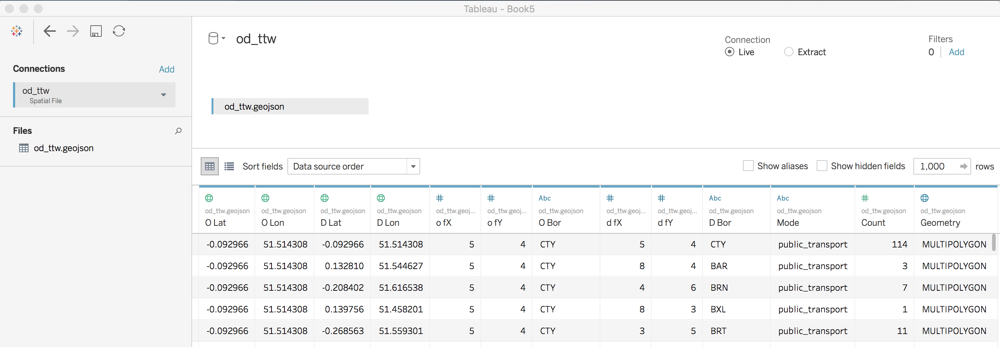
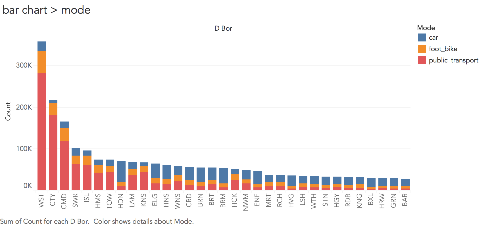
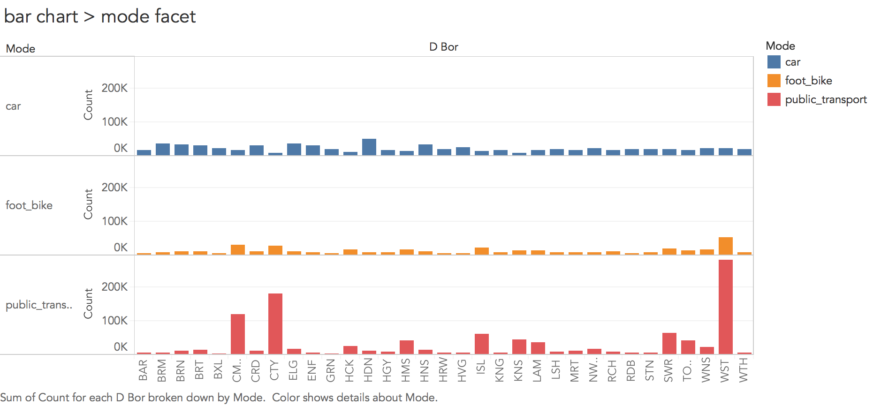
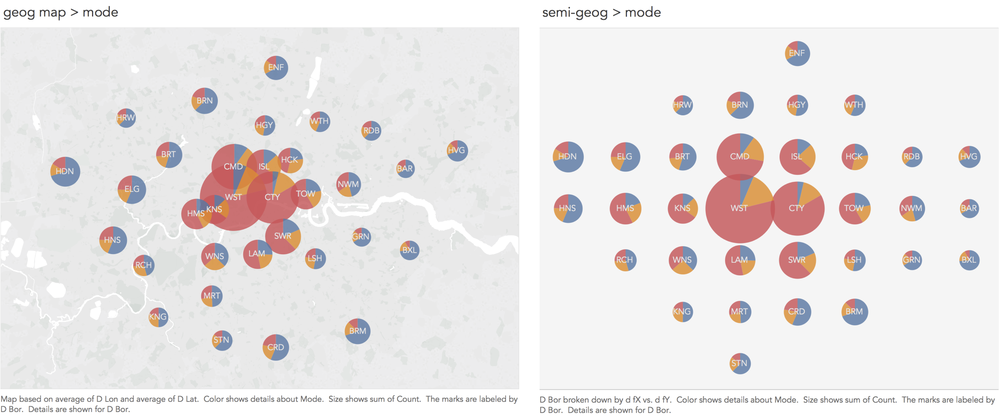
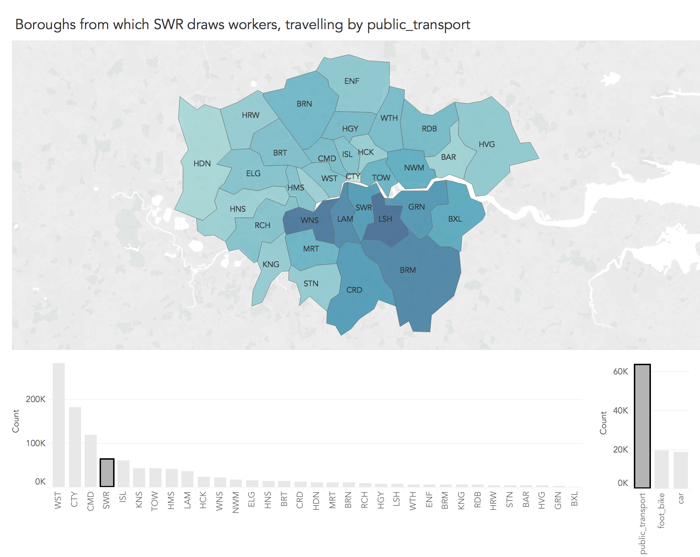
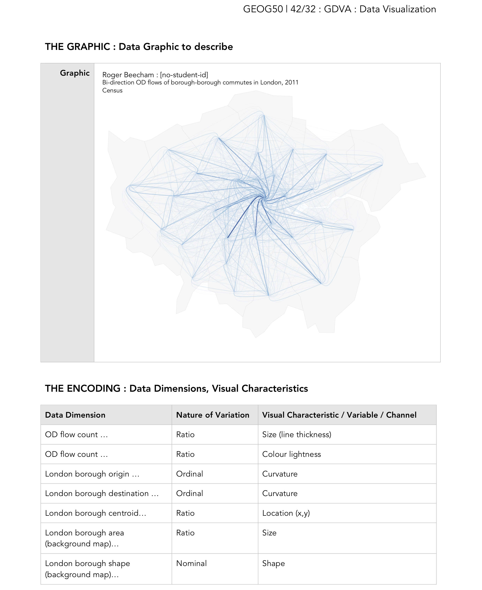

= GEOG50 | 42/32 : Data Visualization
By <https://www.roger-beecham.com[Roger Beecham]>
:docinfo1: menu-include.adoc
:icons: font
:source-highlighter: coderay
:task: sidebar
:aside: NOTE
:stem: latexmath
:fig: TIP
:specification: source,R

include::menu-include.adoc[]

// [quote, Session objective]
// ____
// Use your understanding of visualization theory and design guidelines to generate data-rich information graphics.
// ____

****
**Before the practical** : If you have not done so already, read and work through the link:tableau.html[Tableau] page.

In this session you will use Tableau to generate effective data visualizations. Tableau is a data visualization toolkit developed by Information Visualization researchers with the intention of democratising visual data analysis. It comes with a point- and click- interface and is largely code-free.

By the end of this week's session you should be able to:

* connect Tableau to data files
* demonstrate command of the the Tableau interface, particularly:
  ** _Dimensions_ and _Measures_
  ** filters
  ** groupings
  ** dashboards with linked views
* use Tableau functionality, and your understanding of visual encodings, to generate data-rich information graphics

You will be working with a special class of geospatial data collected via the UK Census: https://census.ukdataservice.ac.uk/get-data/flow-data[origin-destination flow data].
****

== Task 1. _Download data using UK Data Service interface_

A very large, often tedious part, of data science workflow is data collection and cleaning. You will of course be aware of the ever-expanding array of datasets made available by organisations, institutions and private companies.  Over the last decade, well-documented https://en.wikipedia.org/wiki/Application_programming_interface[Application Programming Interfaces] (APIs) have increasingly been used as a consistent and replicable means of accessing data. Often these are designed with bindings to programming languages and environments such as https://www.python.org[Python] and https://www.r-project.org[R] and so can be built into the workflows of analysts with comparatively rudimentary programming experience. These bindings are typically contributed by developers in the Data Science community -- http://personal.tcu.edu/kylewalker/[Kyle Walker's] https://github.com/walkerke/tidycensus[tidycensus] R package provides a very useful interface to the US Census Bureau's Census data.

In this session you will query the 2011 UK Census data using a (more traditional) point- and click- interface: the https://www.ukdataservice.ac.uk[UK Data Service]. Whilst this has its disadvantages -- the interface is idiosyncratic and replicating workflows, or adjusting queries, is far more tedious than when working with an API -- the UK Data Service provides access to a reasonably large number of administrative datasets that you may find useful, especially when you progress onto coursework activity. After the practical, you may wish to spend some time exploring the datasets available to you.

The instructions below provide details for collecting a special class of Census data -- https://census.ukdataservice.ac.uk/get-data/flow-data[origin-destination (OD) flow data]. In this case, the data you will collect describe travel-to-work flows between Local Authority Districts (or Boroughs) of London, of which there are 33. For each borough-to-borough OD pair -- for example Camden-to-Westminster --  the dataset you collect will describe the total number of residents living in Camden who commute to Westminster. You will query a dataset that differentiates by travel mode -- so the relative number of residents commuting between pairs of boroughs by car, bike or public transport can be considered.

[{task}]
--
[horizontal]
Instructions:: Navigate to `https://www.ukdataservice.ac.uk`  [underline]#`Get data`# (horizontal tab), [underline]#`Open data`# (left list). Then under [underline]#`Census flow data`# click on the link [underline]#`Explore via WICID`#. Launch the WICID query builder by clicking [underline]#`WICID - the flexible query builder`#, then [underline]#`Start a new session - no username or password required`#.

Instructions:: From the WICID landing page click on the [underline]#`Data`# tab. From here, [underline]#`Select by Dataset and Table`#,   [underline]#`Commuting and journey to education data`#, [underline]#`2011`#, [underline]#`2011 SWS Merged LA/LA [Location of usual residence and place of work by method of travel to work] - WU03UK - Open`#  (the fourth entry), [underline]#`Location of usual residence and place of work by method of travel to work`#, [underline]#`Select All`#.

Instructions:: Then click on the [underline]#`Geography`# tab and [underline]#`Select or edit origins`#, [underline]#`List Selection`#, [underline]#`UK Local Authorities (merged) 2011`#, scroll down and click [underline]#`Select a higher level geography`#, [underline]#`2011 English Regions plus rest of UK`#,  [underline]#`Confirm that you wish to proceed using this geography`#, check the  box [underline]#`7 / London`#, then [underline]#`Add chosen areas`#. You should see a text notification saying "_Status: 32 origins currently selected_".

Instructions:: Now click again on [underline]#`Geography`# and repeat for destinations:  [underline]#`Select or edit destinations`#, [underline]#`List Selection`#, [underline]#`UK Local Authorities (merged) 2011`#, scroll down and click [underline]#`Select a higher level geography`#, [underline]#`2011 English Regions plus rest of UK`#,  [underline]#`Confirm that you wish to proceed using this geography`#, check the  box [underline]#`7 / London`#, then [underline]#`Add chosen areas`#. You should see a text notification saying "_Status: 32 destinations currently selected_".

Instructions:: Click the [underline]#`Run`# tab, then  [underline]#`Output`# tab, [underline]#`Tabular output`#, select the check box [underline]#`Origin - destination pair list`# under [underline]#`Output layout`# and [underline]#`Comma separated values`# under [underline]#`Output format`#. Click [underline]#`Preview Output and Download`#, [underline]#`- download output file`#,  [underline]#`- download now`#.
--

[{aside}]
--
Wow -- that was quite a set of instructions! This somewhat reinforces the point about the benefits of accessing data programmatically. However, the above hopefully introduces you to the UK Data Service, which interfaces with a large array of datasets likely to be useful to you. You should now have a delimited text file (`wicid_output.csv`) in your [underline]#_downloads_# folder. Open this using Microsoft Excel.

Glancing at the field labels in the top four rows and the data in the subsequent rows  you should get a sense of how the OD data are structured. Each record (row) is a unique origin-destination (OD pair) describing commuter flows between pairs of boroughs. The quantitative fields represent counts of residents commuting between each borough-borough pair by dominant travel mode. The travel mode categories are mutually exclusive and so individuals are not counted twice along the columns.
--

== Task 2. _Load data into Tableau_

.Figure 1: OD travel-to-work data in Tableau [underline]#Data Source# window.
--

--

Keen observers might have noticed that in the `wicid_output.csv` file there are 1,024 records containing data  -- 32 boroughs^2. I mentioned earlier that there are 33 London boroughs. Unfortunately for this category of WICID output two boroughs -- City of London and Westminster -- are merged. The data in this download are also not organised ideally for Tableau and it would be useful to add in spatial data describing the geometry and relative location of London boroughs so that spatial relations can be explored.

That the data harvested from some external resource is not ideally formatted is to be expected. As I mentioned earlier, about 80% of data analysis time is spent on data processing activities. To speed things up, I've re-arranged the dataset, gotten access to data definitions that allow Westminster and City of London to be differentiated and augmented the OD dataset with spatial context (geometries from the http://geoportal.statistics.gov.uk[Open Geography Portal] and semi-spatial layout via https://aftertheflood.com/projects/future-cities-catapult/[aftertheflood]). I've written the dataset to a `.geojson` file.

[{task}]
--
[horizontal]
Instructions::  Download the file from link:data/od_ttw.geojson.zip[this link]. Unzip and then load into Tableau with [underline]#_Connect to data_#, [underline]#_Spatial file_#, browse to [underline]#`od_ttw.geojson`#.
--

Inspecting the [underline]#Data Source# window you will notice that Tableau automatically makes inferences about data types and measurement levels. Fields with numerical values appear with a `#` in the first row of the table headers, textual fields with `Abc` and geographically referenced data with a geodesic globe-like symbol, interpreted by Tableau as https://en.wikipedia.org/wiki/World_Geodetic_System[WGS84] -- pretty clever.

A quick overview of the fields available to you:

* `O Lat`, `O Lon` : together, the centroid of the origin borough (home) of commuters.
* `D Lat`, `D Lon` : together, the centroid of the destination borough (workplace) of commuters.
* `O fX`, `O fY` : together, the approximate location of the origin borough (home) of commuters.
* `D fX`, `D fY` : together, the approximate location of the destination borough (workplace) of commuters.
* `O Bor` : the origin borough (home) of commuters, shortened to three letters.
* `D Bor` : the destination borough (workplace) of commuters, shortened to three letters.
* `Mode` : the travel mode taken (`public_transport`, `foot_bike`, `car`).
* `Count` : the number of commuters travelling between each OD borough using a particular travel mode.
* `Geometry` : an array of coordinates (type `MULTIPOLYGON`) describing the geometry of each destination borough.

Note that the https://en.wikipedia.org/wiki/Primary_key[primary key] for the table is   `<O Bor, D Bor, Mode>` : there is a unique record for each possible OD borough and travel mode pair.

== Task 3. _Generate a bar chart of commute frequency by travel mode, ordered by borough (frequency)_

.Figure 2: Bar chart of frequencies of within London commutes, 2011 Census.
--

--

[{task}]
--
[horizontal]
Instructions::  Create a new worksheet by clicking on the [underline]#_New Worksheet_# tab in the bottom toolbar (next to [underline]#_Data Source_#). Rename the sheet `"bar chart > mode"`.
--

If you've worked through the link:tableau.html[Tableau] page the worksheet display should be familiar to you. The data are automatically organised into [underline]#_Dimensions_# and [underline]#_Measures_# (left margin). [underline]#_Dimensions_# are typically categorical variables used for grouping and pivoting data, which might be achieved via faceting to form small multiples or through colour hue, shape or other visual channels. [underline]#_Measures_# are quantitative (numerical) variables and mapped to size, colour and other visual channels. You can change this allocation by clicking and dragging on field names: drag `o fX`, `o fY`, `d fX`, `d fY` from [underline]#_Measures_# to [underline]#_Dimensions_#.

At the top are the [underline]#_Columns_# and [underline]#_Rows_# shelves. These can be loosely thought of as the x-position and y-position for your charts in Tableau. In the second margin from left is the [underline]#_Marks_# window. This provides access to the numerous visual channels to which data can be mapped.

You will soon discover that Tableau aggregates data according to the configuration provided to [underline]#_Rows_#, [underline]#_Columns_# and [underline]#_Marks_#. You will often wish to disaggregate, and to do so you will need to drag an attribute to the [underline]#_Detail_# icon (under [underline]#_Marks_#).

[{task}]
--
[horizontal]
Instructions::  Drag `Count` to the [underline]#_Rows_# shelf to generate a single bar summarising the total number of all London borough-borough commuters travelling by foot/bike, public transport and car according to 2011 Census (approx 2.2m). Drag `Mode` (a [underline]#_Dimension_#) to the [underline]#_Color_# mark to see a breakdown by travel mode and `D Bor` to [underline]#_Columns_#, ordering by frequency by selecting the [underline]#_sort descending_# button in the top toolbar.
--

Interpreting the chart (Figure 2) requires a little familiarity with London's geography. We find that a very large number of commuting journeys are to two boroughs : Westminster and the City of London (although also Camden). These are boroughs in central London clearly containing many jobs and where travel by car is problematic (notice the lack of blue). Boroughs with smaller bars overall are generally more peripheral (outer) boroughs and notice the change in colour here -- for outer London boroughs, commuting by car is more common.

Thinking about the visualization fundamentals introduced in the lecture, the choice of encodings is effective. We are encoding a continuous quantitative variable (`Count`) with bar length, we differentiate a nominal category variable (`Mode`) using colour hue and we order boroughs using position along the x-axis based on frequency. However, you might also remember from the lecture than in their seminal study and in the crowd-sourced follow-up study, https://www.tandfonline.com/doi/abs/10.1080/01621459.1984.10478080[Cleveland & McGill] and http://idl.cs.washington.edu/papers/crowdsourcing-graphical-perception/[Heer & Bostock] found judging lengths along an aligned scale to be considerably more effective than on an unaligned scale. In the stacked bar chart in Figure 2, the `foot_bike` and `car` categories are not aligned. This is likely to be problematic were more categories of travel mode (say five or six) to be compared.  You may wish to update your chart to generate bars on an aligned scale for each category of travel mode (faceting on travel mode -- as in Figure 3).

[{task}]
--
[horizontal]
Instructions:: Drag `Mode` onto the [underline]#_Rows_# shelf to facet the chart on travel mode.
--

.Figure 3: Bar chart of frequencies of within London commutes faceted by travel mode, 2011 Census.
--

--

[{aside}]
--
If you managed to create the faceted chart in Figure 3, you may wish to select the [underline]#_sort descending_# button in the top toolbar for each travel mode. This allows you to further explore the dominant travel mode into London boroughs. Great, you've just performed an interactive visual analysis query!
--

== Task 4. _Generate a map of commute frequency by travel mode, ordered by borough (spatial position)_

.Figure 4: Maps of frequencies of within London commutes by travel mode, 2011 Census.
--

--

So far we've a sense of commute frequency and travel mode type into London's 33 boroughs and made some inferences about the nature of commuting given some existing knowledge of the city: that London-resident workers travel in greatest number to boroughs located in central London and that travel by public transport dominates for those travelling into these boroughs for work, while the reverse is true of peripheral boroughs with fewer commuters and travel by car dominating.

These claims could be investigated more directly by manipulating the plot encodings such that the bars in Figures 2 and 3 are not ordered by frequency, but by geographic position.

[{task}]
--
[horizontal]
Instructions:: Start a new worksheet and rename as `"geog map > mode"`. Drag `D lon` onto the [underline]#_Columns_# shelf and `D lat` onto the [underline]#_Rows_# shelf. You should find that Tableau automatically generates a zoom- pan- https://wiki.openstreetmap.org/wiki/Slippy_Map[slippy map] and a single dot representing the avg longitude and latitude position of borough centroids in London. Drag `D Bor` to the [underline]#_Detail_# mark in order to create a dot representing each borough. Size the dots by frequency by dragging `Count` to the [underline]#_Size_# mark, then drag `Mode` to the [underline]#_Color_# mark. In the figure above I have slightly adjusted the settings for these marks and added labels. You may wish to do the same.
--

A problem with arranging data graphics according to their _exact_ geographic position, clearly, is that activity tends to  concentrate in more densely populated areas (with jobs in this case) -- the circles overlap one another in central London. Again, there are much more problematic instances of this than in Figure 4. However, one solution is to relax geography a little and arrange boroughs according to their _approximate_ spatial position (right of Figure 4). There is a large literature on how to effect semi-geographic arrangements. The arrangement in Figure 4 is based on the https://aftertheflood.com/projects/future-cities-catapult/[aftertheflood] layout, but https://www.gicentre.net/small-multiples-with-gaps/[Meulemans et al. (2017)] provides an overview and suggests an interesting and elegant approach to automatically generating these layouts.

[{task}]
--
[horizontal]
Instructions:: Create a copy of your `geog map > mode` by right clicking on the tab in the bottom toolbar and selecting  [underline]#_Duplicate_#, then rename as `"semi-geog > mode"`. Replace `D lon` with `D fX` on the [underline]#_Columns_# shelf and `D lat` with `d fY` on the [underline]#_Rows_# shelf. Resize the cells defining each row-column instance by clicking and dragging on the cell boundary.
--

[{aside}]
--
Organising boroughs according to  their geographic position has several advantages: it reveals a reasonably complex set of spatial relations. You might have noticed that Figure 4 does not use the most effective visual encoding channels: we cannot show frequencies on an aligned scale since position is already in use. Angle and area are also not the best visual channels for conveying quantities. The design decisions can nevertheless be justified. With only three categories to distinguish using colour hue, angle works fine at conveying the relative importance of travel mode and with such large differences in absolute frequencies between central London boroughs and those at the periphery, the fact that we underestimate circle size for Westminster and the City (given https://www.tandfonline.com/doi/abs/10.1080/01621459.1984.10478080[Cleveland & McGill 1984]) is not so much of a concern.

Representing information on both the absolute and relative size of a phenomenon simultaneously is a common requirement in visualization design: see http://vita.had.co.nz/papers/prodplots.pdf[Wickham & Hofman (2011)] for a more detailed deiscussion of the challenges.
--

== Task 5. _Generate a full OD matrix of frequencies by travel mode_

.Figure 5: OD matrix of frequencies of London borough-borough commutes faceted by travel mode, 2011 Census.
--
image:images/od_matrix_mode.png[]
--

You may have noticed that in the analysis above we've simply been aggregating over destinations and summarising frequencies by travel mode into those boroughs. We've not considered the origin data -- the boroughs from which residents are travelling. There are 33 boroughs in London and therefore 3,267 (33^2 x 3 travel modes) possible OD pairs to analyse. This makes (visual) analysis of the full OD dataset challenging.

In Figure 5, the full OD data are represented as an OD matrix. Boroughs are ordered alphabetically left-to-right and top-to-bottom and cells coloured according to frequency.
[{task}]
--
[horizontal]
Instructions:: To create the full OD matrix : Start a new worksheet and rename `"od matrix > mode"`. Drag `D Bor` to the [underline]#_Rows_# shelf and `O Bor` to the [underline]#_Columns_# shelf. Then drag `Count` to the [underline]#_Color_# mark. You will need to play around with the cell sizing in order to fit to a single screen. In order to facet on travel mode, drag `Mode` onto the [underline]#_Columns_# shelf ensuring that it is placed before the `O Bor` pill.

Analyse:: What can be inferred from Figure 5 about patterns of OD commuting between London boroughs? How does this structure vary by travel mode?
--

== Task 6. _Generate an interactive choropleth of frequencies by origin_

.Figure 6: Interactive choropleth map displaying frequencies of home boroughs from which the selected borough draws workers, 2011 Census.
--

--

Figure 5 is certainly data dense -- 3,267 OD flow values are encoded! However, since cells in the matrix are ordered alphabetically, it is difficult to make inferences around more complex spatial patterns in OD commuting behaviour. Representing spatial relations in OD data is challenging. Attempts that involve drawing lines between OD pairs often fail (e.g. http://oobrien.com/2017/08/eight-ways-to-better-flow-maps/[this blog post]). One solution, proposed by https://www.gicentre.net/jwo/index[Jo Wood] is http://openaccess.city.ac.uk/537/[Spatially-Ordered OD matrices], where the cells in the OD matrix are reordered according to their geographic position. This results in spatially-arranged small multiple maps -- in this case there would be 33 representing destinations (workplaces), each displaying counts of commuter origins.

Generating these layouts in Tableau is not easy, though https://public.tableau.com/profile/robradburn#!/vizhome/LiquidCapital/VirtualWater[is possible]. Inspired by this technique we will generate an interactive choropleth which focuses on journeys to each destination borough (workplace) in turn, displaying frequencies of the origin boroughs from which the destination borough draws workers.

[{task}]
--
[horizontal]
Instructions:: First create charts that will be used to filter the choropleth. Start a new worksheet and rename `"bar chart > borough filter"`. Drag `D Bor` to the [underline]#_Columns_# shelf and `Count` to the [underline]#_Rows_# shelf. Colour the bars light grey. Start another new sheet and rename `"bar chart > mode filter"`. Drag `Mode` to the [underline]#_Columns_# shelf and `Count` to the [underline]#_Rows_# shelf. Again, colour the bars light grey.

Instructions:: Next create the choropleth itself. Start a new sheet and rename it `"choropleth > origins mode interact"`. Drag `Longitude (generated)` to the [underline]#_Columns_#  shelf, `Latitiude (generated)` to the [underline]#_Rows_#  shelf and `Geometry` to the [underline]#_Detail_# mark. You should see a filled map of London borough outlines. Drag `D Bor` to  the [underline]#_Detail_# mark, `O Bar` to the [underline]#_Label_# mark and `Count` to the the [underline]#_Color_# mark. At the moment the fill doesn't mean too much as we need to filter to select a single destination (workplace) borough.

Instructions:: Start a new dashboard by clicking on the [underline]#_New Dashboard_# icon and rename `"dashboard > choropleth interact"`. Hopefully you will have a sense of Tableau's dashboard environment from the link:tableau.html[Tableau] page. Under [underline]#_Sheets_# in the left margin there is a list of your created worksheets. Drag  `choropleth > origins mode interact` into the main dashboard window. Click on the chart. The chart window should now be outlined with a dark border. Select the down arrow in the top right-hand corner of the chart window and check the [underline]#_Floating_# option. Adjust the size and position of the chart to match that of Figure 6. Drag `bar chart > borough filter` and `bar chart > mode filter` and resize and reposition in the same way. When selecting on these charts (e.g. when outlined with a dark border), check the [underline]#_Use as Filter_# icon in the top right corner -- do so for both  `bar chart > borough filter` and `bar chart > mode filter`.

Interact:: Click the `foot_bike` bar and `CTY` bar: the choropleth is now displaying frequencies of residents from boroughs commuting into the City of London by foot or bike. Now click on `public_transport` : as expected the City of London draws workers travelling by tube, bus and train from a far  wider set of boroughs than by foot and bike.

Instructions:: A dynamic chart title will aid interpretation. Double-click on the title for the choropleth map. An [underline]#_Edit Title_#  window will appear. This defaults to `<Sheet Name>` -- the `<>` syntax is used to inject named objects. Replace this text with `"Boroughs from which <D Bor> draws workers, travelling by <Mode>"` -- the selected travel mode and destination borough is injected into the chart title.

Analyse:: Spend some time exploring flows into London boroughs by travel mode. What observations can be made about commuter travel behaviour?
--

[{aside}]
--
I've recently written a blog post describing some of the challenges of visualizing OD flow data, along with some implemented solutions using https://ggplot2.tidyverse.org[ggplot2]. The post can be viewed from https://medium.com/@roger.beecham.231/upgrading-spatial-analysis-of-origin-destination-data-using-modern-vis-frameworks-part-1-of-2-ee1c6481a595[this link].
--

== Assessed Task

This is a short, assessed task, borrowed heavilty from an activity written by https://www.gicentre.net/jsndyks[Jason Dykes]. It does not assume knowledge or skills above what you have learnt in the lecture and this session. Ideally, the task should be completed *within* the practical session -- the aim is not to burden you with additional work.

The task is designed to:

* check that you can produce outputs in Tableau
* assess your understanding of data types and their visual encoding

The document into which you will work can be downloaded from link:data/DVA_Unit5.docx[this link] (`.docx` format). Save this document to a local directory. Once you've completed the task, save  using the filename `"DVA_Unit5_<StudentID>"`, replacing <student ID> with your own student ID number. Upload the completed document to the VLE, via the [underline]#_Assessment_# page.

In Figure 7, I've included an example of a graphic I created on the same dataset, but deliberately not using (and not possible with) Tableau. Consult the link:lecture.html[lecture slides] for a reminder of data types and visual variables (or channels).

=== Assessed task : _Export_

[{task}]
--
Select a *single graphic* from the set that you have just created. Edit the title with: `"<your-name : > <some sensible title>"`. Remember you need to double click and update the contents of the [underline]#_Edit Title_# window. Export the graphic as a `.png` file by navigating to [underline]#_Worksheet_#, [underline]#_Export_#, [underline]#_Image_#. Paste the grahic into the [underline]#_Graphic_# box of the assessment template file.
--

=== Assessed task : _Describe_

[{task}]
--
Describe the encoding used in the graphic by completing the table under [underline]#_The Encoding_# section of the assessment template file.
--

=== Assessed task : _Upload_

[{task}]
--
Remove the comments from the assessment template as per the instructions at the top of the first page,  save  using the filename `"DVA_Unit5_<StudentID>.docx"` and upload to the VLE.
--
.Figure 7: Example submission (non-Tableau example).
--

--

---
[small]#Content by http://www.roger-beecham.com[Roger Beecham] | 2018 | Licensed under https://creativecommons.org/licenses/by/4.0/[Creative Commons BY 4.0].#
