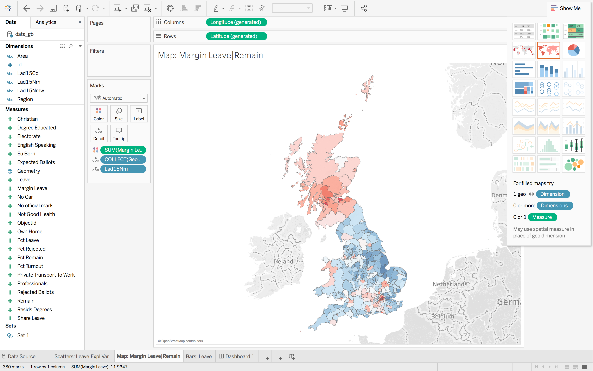
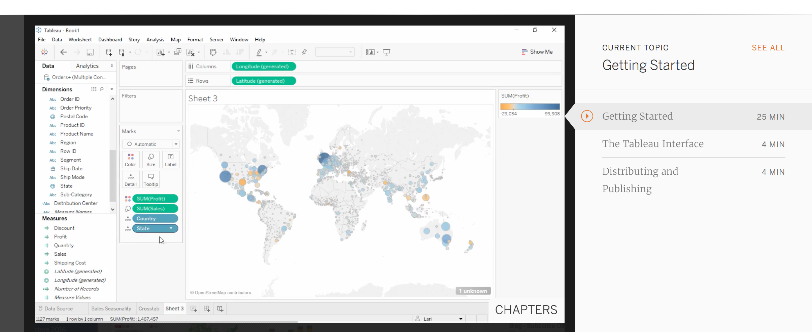

= GEOG50 | 42/32 : Data Visualization
By <https://www.roger-beecham.com[Roger Beecham]>
:docinfo1: menu-include.adoc
:icons: font
:source-highlighter: coderay
:task: sidebar
:aside: NOTE
:stem: latexmath
:fig: TIP
:specification: source,R

include::menu-include.adoc[]

****
Tableau is a data visualization toolkit developed by Information Visualization researchers with the intention of democratising visual data analysis. It comes with a point- and click- interface and is code-free.

As with most software tools, familiarity with the interface and typical workflows is an advantage. Try to work through this short introduction in advance of your Tuesday | Wednesday practical.
****

== What is Tableau?

Tableau is a commercial software tool for visual data analysis. It has roots in academia; its https://research.tableau.com/people[research department] has contributed several notable papers to the _InfoVis_ discipline in recent years. And those of you with an interest in Data Visualization may well have come across Robert Kosara, of Tableau Research, and his influential https://eagereyes.org[blog]. What makes Tableau distinct from other data analysis tools is the very heavy emphasis on the _visual_ perspective in data analysis.

== Getting Tableau

Tableau is commercial software -- so is not free to use and in fact is quite expensive. However, great for you: it is free to students and university staff. The University of Leeds also has an institutional licence -- so it is fully installed on the machines in the labs. It also makes sense to have a version of Tableau Desktop running on your own machines. You can do this by following the links below.

* http://www.tableau.com/academic/students[register for a student key]
* http://www.tableau.com/products/desktop[download Tableau desktop]

== Why Tableau?

Since the company was founded in 2003, Tableau has seen rapid growth and is widely used in industry (e.g. https://www.tableau.com/about/customers[companies list]). Whilst Tableau has its frustrations, underpinning its design and layout are key tenets of visualization design: of data types and their mapping through visual variables. In a similar way to https://ggplot2.tidyverse.org[ggplot2] and https://vega.github.io/vega-lite/[vega-lite], Tableau forces its users to consider the visual grammar behind their graphics and data analysis.  Finally, although not open and free to use, Tableau is sustained by a very large community of users, which is cultivated by Tableau through its https://www.tableau.com/zen-masters[Zen Masters] programme. Should you wish to develop some expertise in Tableau, you may find their http://www.makeovermonday.co.uk[MakeOverMonday] useful. http://robertradburn.co.uk[Rob Radburn], a UK-based _Zen Master_, has posted some great examples with an implied _geographic_ flavour.

== Why not Tableau?

Tableau is a software tool rather than programming language. It therefore relies on point-and-click interactions, making reproduction of workflows problematic. As with all software tools, it can be slightly idiosyncratic -- you need to understand/convert your thinking into a Tableau way of organising data. You may at first find particularly confusing the means through which data are aggregated and grouped in Tableau. Related to this, there is a layer of abstraction between the user and dataset. Tableau does not offer much support for data cleaning and since aggregation and summarisation tends to be performed by Tableau automatically, a user may not know quite what a plot is showing -- you'll discover this for yourselves. Despite these problems, Tableau is a very accessible software tool.  Crucially, and probably uniquely, it is a genuine, off-the-shelf interactive visual data analysis tool.

== How the Tableau display is organised

=== Data handling
Tableau works with tabular data -- where rows are populated with observations and columns with variables that describe observations. Once loaded into Tableau, data are automatically organised into _Dimensions_ and _Measures_ (left margin of Figure 1). _Dimensions_ are typically categorical variables used for grouping and pivoting data, which might be achieved via faceting to form small multiples or through colour hue, shape or other visual channels. _Measures_ are quantitative (numerical) variables and mapped to size, colour and other visual channels. As of Tableau `--version 10.2`, spatial data types are supported. Geometry information is converted and stored in a variable called `Geometry`, each element of which contains a list of type `MULTIPOLYGON`.

=== Windows
At the top of Figure 1 are the _Columns_ and _Rows_ shelves. These can be loosely thought of as the x-position and y-position for your charts in Tableau.

In the second margin of Figure 1 is the _Marks_ window. This provides access to the numerous visual channels to which data can be mapped.

You will soon discover that Tableau aggregates data according to the configuration provided to _Rows_, _Columns_ and _Marks_. You will often wish to disaggregate, and to do so you will need to drag an attribute to the _Detail_ icon (under _Marks_).

.Figure 1: The Tableau user interface.
--

--

== Task : Listen and explore

Perhaps the best means of introducing Tableau is through the introductory tutorial provided by Tableau themselves. The tutorial can bebe accessed from https://www.tableau.com/learn/tutorials/on-demand/getting-started[this link]. Note that you will need to sign in to access the tutorial.

[{task}]
--
[horizontal]
Instructions:: Follow the instructions in the c.20-minute video. Use Tableau Desktop to open the data and generate the story as described in the video. Do pause the video to try some of the techniques out. Ignore the Chapters: `Connecting live versus extracting, 03:28`, `Story Points, 22:06`, `Distributing Content, 23:35`.
--

.Figure 2: The Tableau tutorial.
--

--

---
[small]#Content by http://www.roger-beecham.com[Roger Beecham] | 2018 | Licensed under https://creativecommons.org/licenses/by/4.0/[Creative Commons BY 4.0].#
